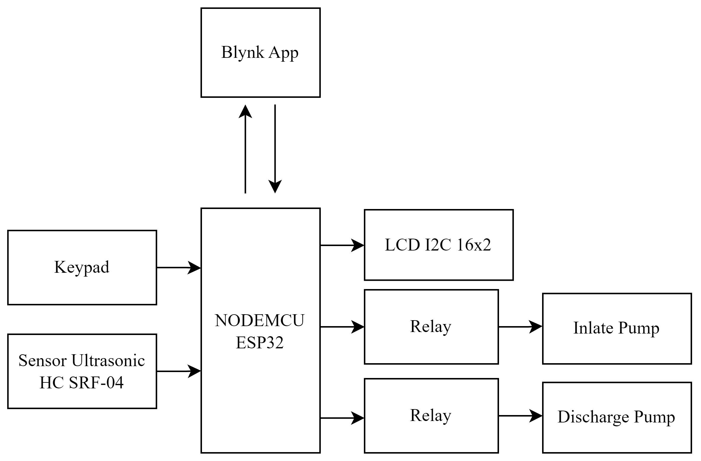
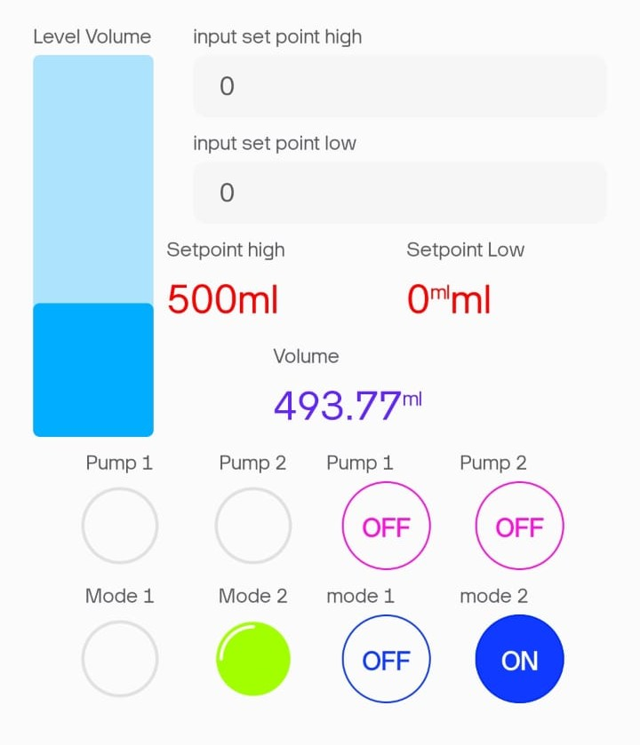
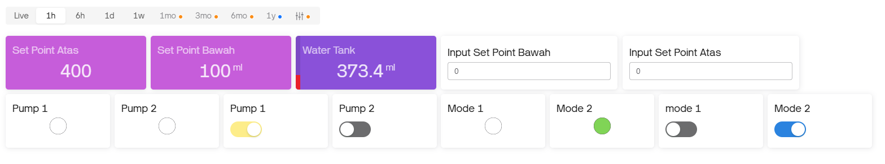
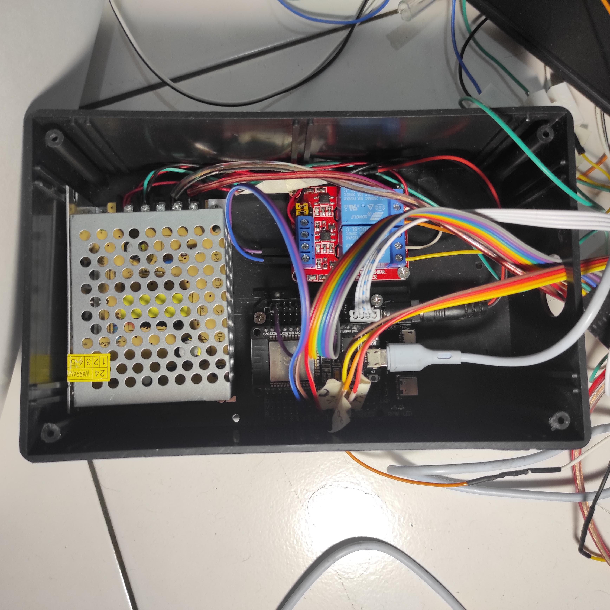
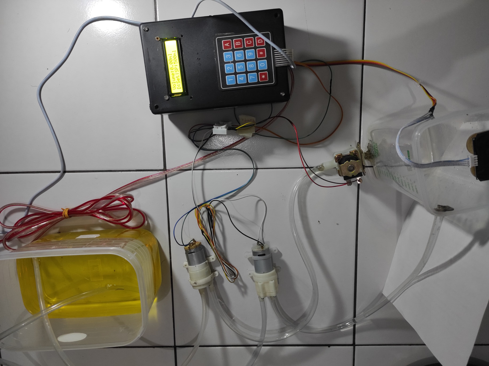

# iot-oil-filling-control-system
This project is an IoT-based water level monitoring system using an ESP32 microcontroller as the core controller. The system is integrated with the Blynk platform for both web and mobile applications, allowing real-time monitoring and control.

> The system features two operating modes:
- Mode 1: The motor activates when the water level is below the setpoint and stops once the setpoint is reached. However, this mode is sensitive to sensor fluctuations, which may affect reliability.
- Mode 2 (Enhanced Mode): This improved version introduces dual setpoints. The motor turns off at the upper threshold and only resumes filling when the water level drops below the lower threshold, reducing the impact of sensor noise.

The sensor data is processed using linear regression, allowing the system to estimate the volume of water in the container instead of just the raw level value. Mode 1 resulted in an error rate of 8.26%, primarily caused by sensor fluctuations. In contrast, Mode 2, which uses upper and lower threshold setpoints, reduced the error to 1.48%, indicating better performance and reliability.

# Block Diagram System

# Design Blynk
### Mobile

### Dekstop

# Documentation

